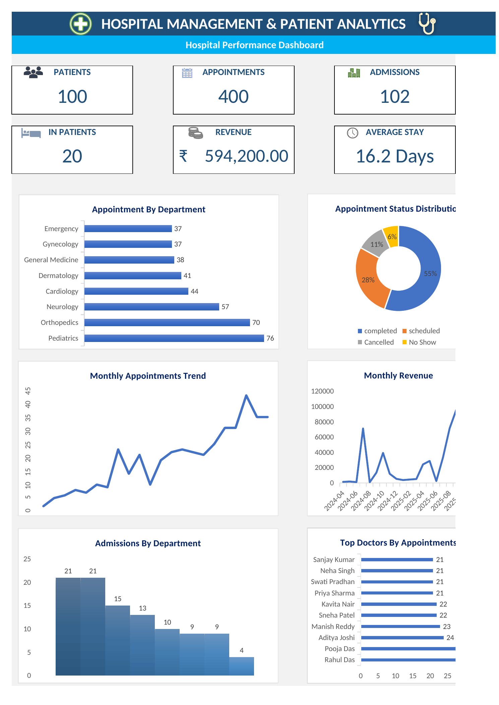

# Hospital Management System & Patient Analysis

An end-to-end SQL + Excel analytics project simulating hospital operations —
patients, doctors, appointments, admissions, and billing — designed, built,
analyzed, and visualized as a portfolio piece.

## Project Overview

This project models a hospital: patients register, book appointments with
doctors, sometimes get admitted to a room, receive prescriptions, and get
billed. The database schema and all sample data were designed from scratch
in MySQL, then analyzed with 20+ business SQL queries, and finally
visualized in an interactive Excel dashboard with KPI cards, charts, and
trend lines.

**Pipeline:** MySQL Database → Business SQL Queries → Excel (via ODBC live
connection) → KPI Cards + Charts → Hospital Analytics Dashboard

## Tech Stack

- **Database:** MySQL 8.0+
- **Analysis:** SQL (joins, subqueries, window functions, CTEs)
- **Visualization:** Excel (live ODBC connection to MySQL, PivotTables, charts)
- **Tables:** 8 (Departments, Doctors, Patients, Rooms, Appointments,
  Admissions, Prescriptions, Billings)

## Entity-Relationship Overview

```
Departments (1) ───< Doctors (many)
Patients    (1) ───< Appointments (many) >─── (1) Doctors
Patients    (1) ───< Admissions   (many) >─── (1) Doctors, (1) Rooms
Appointments(1) ───< Prescriptions (many)
Billings    ─── links to EITHER one Appointment OR one Admission
                 (nullable foreign keys, never both)
```

- One department has many doctors.
- One patient can have many appointments and many admissions.
- One appointment can produce many prescriptions.
- One bill is tied to either one appointment (a consultation charge) or
  one admission (a room-stay charge) — never both. This is modeled with
  nullable `Admission_ID` / `Appointment_ID` columns on `Billings`, which
  is why several queries use `LEFT JOIN` + `COALESCE` to trace a bill back
  to the right patient or doctor.

## Files in This Project

| File | Purpose |
|---|---|
| `01_Requirement_Documents.Md` | Project requirements and business requirements |
| `02_Database_Creation.sql` | Creates the MySQL database and 8 tables |
| `03_ER_Diagram.png` | Entity-Relationship Diagram of the database |
| `04_Insert_Data.sql` | Inserts sample data into the database |
| `05_Data_Validation.sql` | Validates data integrity and relationships |
| `06_Analysis_Queries.sql` | Business analysis queries for hospital operations |
| `07_Hospital_Analytics_Dashboard.xlsx` | Excel dashboard with KPI cards and charts |
| `README.md` | Project documentation |

## How to Run

1. Install MySQL 8.0+ and MySQL Workbench.
2. Run `02_Database_Creation.sql` to create the database and tables.
3. Run `04_Insert_Data.sql` to insert the sample data.
4. Run `05_Data_Validation.sql` to verify data integrity.
5. Run `06_Analysis_Queries.sql` to execute the business analysis queries.
6. Open `07_Hospital_Analytics_Dashboard.xlsx` to view the Excel dashboard.

### Excel Connection

The Excel dashboard is connected to MySQL using a MySQL ODBC connection through Power Query.

**Pipeline:**

MySQL → SQL Analysis → ODBC → Power Query → Excel Dashboard

Click **Data → Refresh All** in Excel to refresh the connected data.
```bash
mysql -u root -p < 01_Schema.sql
mysql -u root -p < 02_Sample_Data.sql
mysql -u root -p Hospital_Management_System < 11_indexes.sql
mysql -u root -p Hospital_Management_System < 03_Business_Queries.sql
```

To reproduce the Excel dashboard: connect Excel to MySQL via
`Data > Get Data > From Database > From ODBC` using a MySQL ODBC driver,
then load `13_all_KPIs_combined.sql` and the individual section queries
as separate Power Query connections.

## SQL Business Analysis

The project contains 29 business-focused SQL questions covering hospital operations, doctors, patients, appointments, admissions, rooms, billing, revenue, and advanced SQL analysis.

### 1. Hospital Overview

1. What is the total number of patients?
2. What is the total number of doctors?
3. What is the total number of departments?
4. What is the total number of appointments?

### 2. Doctor & Department Analysis

5. How many doctors work in each department?
6. Which department has the highest number of doctors?
7. How many appointments has each doctor handled?
8. Which doctor has the highest number of appointments?
9. What is the average consultation fee by department?
10. Which doctors charge above the hospital's average consultation fee?

### 3. Patient Analysis

11. What is the gender distribution of patients?
12. How many patients have visited the hospital more than once?
13. Which patients have both appointments and hospital admissions?
14. Which patients have appointments but were never admitted?
15. What percentage of patients have visited the hospital more than once?

### 4. Appointment Analysis

16. What is the distribution of appointment statuses?
17. Which doctor has the highest number of completed appointments?
18. Which department has the most appointments?
19. What is the monthly appointment trend?
20. Which doctors have more appointments than the average doctor?

### 5. Admission & Room Analysis

21. How many patients are currently admitted?
22. Which rooms are used most frequently?
23. What is the average hospital stay?
24. Which department has the most hospital admissions?

### 6. Billing & Revenue Analysis

25. What is the total hospital revenue?
26. What is the average billing amount?
27. What is the monthly revenue trend?

### 7. Advanced SQL Analysis

28. How can doctors be ranked by appointment count using a window function?
29. Who are the top 3 doctors in each department based on appointment count?

**Plus 6 additional KPI queries** (`12_6_additional_KPIs.sql`): completed
appointment count, currently-admitted count, pending revenue, average
consultation fee, average billing amount, average stay length.

## Excel Dashboard

The final deliverable is an interactive Excel dashboard connected directly to the MySQL database through ODBC and Power Query.

The dashboard contains:

- **6 KPI Cards**
  - Total Patients
  - Total Appointments
  - Total Admissions
  - Current Inpatients
  - Total Revenue
  - Average Stay

- **6 Charts**
  - Appointments by Department — horizontal bar chart
  - Appointment Status Distribution — doughnut chart
  - Monthly Appointments Trend — line chart
  - Monthly Revenue Trend — line chart
  - Admissions by Department — bar chart
  - Top Doctors by Appointment Count — bar chart

### Dashboard Refresh

The dashboard uses a live ODBC connection to MySQL.

To refresh the dashboard:

**Excel → Data → Refresh All**

This updates the connected query results used by the dashboard.

## Dashboard Preview




## Key Results

- **100** patients registered and **400** total appointments recorded.
- **102** total hospital admissions, with **20** patients currently admitted.
- **₹5,94,200** total revenue collected.
- **Pediatrics** recorded the highest appointment volume with **76 appointments**, followed by **Orthopedics** with **70**.
- The average hospital stay is **16.2 days**.
- **Rahul Das** and **Pooja Das** recorded the highest appointment volume with **33 appointments each**.


## Skills Demonstrated

- Relational database design and table relationships
- Primary keys and foreign keys
- Multi-table `JOIN`s
- Aggregate functions: `COUNT`, `SUM`, `AVG`, `COUNT DISTINCT`
- `GROUP BY` and `HAVING`
- Common Table Expressions (CTEs)
- Subqueries
- Window functions: `RANK()` and `ROW_NUMBER()`
- `CASE` expressions
- Date functions: `DATEDIFF()` and `DATE_FORMAT()`
- Data validation and integrity checks
- MySQL to Excel integration using ODBC
- Power Query for loading and refreshing SQL results
- Excel dashboard creation with KPI cards and charts
- Business-oriented data analysiss

## Project Structure

```text
Hospital-Management-Patient-Analytics/
│
├── 01_Requirement_Documents.Md
├── 02_Database_Creation.sql
├── 03_ER_Diagram.png
├── 04_Insert_Data.sql
├── 05_Data_Validation.sql
├── 06_Analysis_Queries.sql
├── 07_Hospital_Analytics_Dashboard.xlsx
├── Dashboard_Screenshot.png
└── README.md 

## How to Talk About This in an Interview

*"I designed a normalized 8-table hospital database in MySQL, where a bill
can be linked to either a consultation or a room stay but never both —
which meant several queries needed to trace the right doctor or patient
through whichever link was filled in, using LEFT JOIN and COALESCE. I
wrote 20+ business queries organized into six sections — KPIs, doctor and
department performance, patient analysis, monthly trends, revenue
breakdowns, and two advanced queries using a window function and a
correlated subquery. I then connected Excel directly to MySQL over ODBC
to build a live, refreshable dashboard with KPI cards and six charts,
rather than a static copy-pasted report. Along the way, I also caught a
real data-integrity bug — some dates were occurring before a patient's
registration date — and fixed the underlying data logic, verifying it
with cross-table validation queries."*


